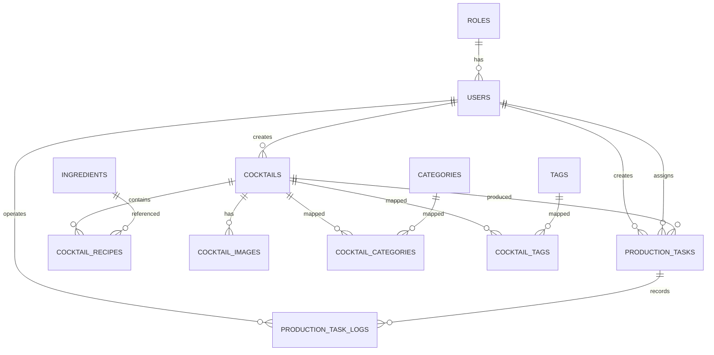

# 鸡尾酒数据库项目数据库设计文档

## 1. 文档说明

本文档用于定义鸡尾酒数据库项目一期的 MySQL 数据库结构，覆盖以下业务范围：

- 鸡尾酒基础资料管理
- 分类、标签、原料、图片管理
- 管理员 / 服务员账号管理
- 前台业务端待制作任务管理
- 用户角色预留扩展

本文档目标是让后续开发可以直接据此完成：

- MySQL 建表
- 后端实体设计
- 接口字段定义
- 基础索引规划

## 2. 数据库设计原则

### 2.1 数据库建议

- 数据库名称建议：`cocktail_db`
- 存储引擎：`InnoDB`
- 字符集：`utf8mb4`
- 排序规则建议：`utf8mb4_unicode_ci`

### 2.2 命名规范

- 表名统一使用复数英文小写，下划线分隔。
- 主键统一使用 `id`。
- 外键字段统一使用 `xxx_id`。
- 时间字段统一使用：
  - `created_at`
  - `updated_at`
- 状态字段优先使用字符串编码或数字编码，不建议过度依赖 MySQL `ENUM`，便于后续扩展。

### 2.3 一期设计说明

- 一期采用“公开前台 + 业务前台 + 后台管理”的统一数据库。
- 用户角色一期包含：`admin`、`staff`，并预留 `customer`。
- 鸡尾酒与分类、标签均为多对多关系。
- 配方按“鸡尾酒 - 原料明细”结构设计。
- 待制作任务独立建表，支持状态流转与操作日志。

## 3. 表结构总览

一期建议包含以下数据表：

| 表名 | 说明 |
| --- | --- |
| `roles` | 角色表 |
| `users` | 用户表 |
| `cocktails` | 鸡尾酒主表 |
| `categories` | 分类表 |
| `cocktail_categories` | 鸡尾酒分类关联表 |
| `tags` | 标签表 |
| `cocktail_tags` | 鸡尾酒标签关联表 |
| `ingredients` | 原料表 |
| `cocktail_recipes` | 鸡尾酒配方明细表 |
| `cocktail_images` | 鸡尾酒图片表 |
| `production_tasks` | 待制作任务表 |
| `production_task_logs` | 待制作任务操作日志表 |

## 4. 关系模型概览

## 5. 详细表设计

## 5.1 `roles` 角色表

用于定义系统角色，支持后续扩展客户角色。

| 字段名 | 类型 | 约束 | 说明 |
| --- | --- | --- | --- |
| `id` | BIGINT UNSIGNED | PK, AUTO_INCREMENT | 主键 |
| `code` | VARCHAR(32) | NOT NULL, UNIQUE | 角色编码，如 `admin`、`staff`、`customer` |
| `name` | VARCHAR(50) | NOT NULL | 角色名称 |
| `description` | VARCHAR(255) | NULL | 角色描述 |
| `is_system` | TINYINT(1) | NOT NULL DEFAULT 1 | 是否系统内置角色 |
| `sort_order` | INT | NOT NULL DEFAULT 0 | 排序值 |
| `created_at` | DATETIME | NOT NULL | 创建时间 |
| `updated_at` | DATETIME | NOT NULL | 更新时间 |

建议初始化数据：

| code | name | 说明 |
| --- | --- | --- |
| `admin` | 管理员 | 可访问后台和业务前台 |
| `staff` | 服务员 | 可访问业务前台 |
| `customer` | 客户 | 一期预留 |

## 5.2 `users` 用户表

用于存储管理员、服务员以及未来客户账号。

| 字段名 | 类型 | 约束 | 说明 |
| --- | --- | --- | --- |
| `id` | BIGINT UNSIGNED | PK, AUTO_INCREMENT | 主键 |
| `username` | VARCHAR(50) | NOT NULL, UNIQUE | 登录账号 |
| `password_hash` | VARCHAR(255) | NOT NULL | 密码哈希值 |
| `display_name` | VARCHAR(100) | NOT NULL | 显示名称 |
| `phone` | VARCHAR(20) | NULL | 手机号 |
| `email` | VARCHAR(100) | NULL | 邮箱 |
| `role_id` | BIGINT UNSIGNED | NOT NULL, FK | 角色 ID，关联 `roles.id` |
| `status` | VARCHAR(20) | NOT NULL DEFAULT 'active' | 状态：`active` / `disabled` |
| `last_login_at` | DATETIME | NULL | 最后登录时间 |
| `created_at` | DATETIME | NOT NULL | 创建时间 |
| `updated_at` | DATETIME | NOT NULL | 更新时间 |

索引建议：

- 唯一索引：`uk_users_username(username)`
- 普通索引：`idx_users_role_id(role_id)`
- 普通索引：`idx_users_status(status)`

## 5.3 `cocktails` 鸡尾酒主表

存储鸡尾酒基础信息。

| 字段名 | 类型 | 约束 | 说明 |
| --- | --- | --- | --- |
| `id` | BIGINT UNSIGNED | PK, AUTO_INCREMENT | 主键 |
| `name_zh` | VARCHAR(100) | NOT NULL | 中文名 |
| `name_en` | VARCHAR(100) | NULL | 英文名 |
| `slug` | VARCHAR(150) | NULL, UNIQUE | 前台 URL 标识 |
| `short_description` | VARCHAR(500) | NULL | 简短描述 |
| `description` | TEXT | NULL | 详细介绍 |
| `base_spirit` | VARCHAR(100) | NULL | 基酒类型 |
| `abv_note` | VARCHAR(50) | NULL | 酒精度说明 |
| `glass_type` | VARCHAR(100) | NULL | 杯型 |
| `taste_profile` | VARCHAR(255) | NULL | 口感说明 |
| `garnish` | VARCHAR(255) | NULL | 装饰说明 |
| `method` | TEXT | NULL | 制作方法 |
| `scene` | VARCHAR(255) | NULL | 饮用场景 |
| `cover_image_url` | VARCHAR(500) | NULL | 封面图地址 |
| `publish_status` | VARCHAR(20) | NOT NULL DEFAULT 'draft' | 发布状态：`draft` / `published` / `hidden` |
| `is_visible` | TINYINT(1) | NOT NULL DEFAULT 1 | 前台是否可见 |
| `sort_order` | INT | NOT NULL DEFAULT 0 | 排序值 |
| `created_by` | BIGINT UNSIGNED | NULL, FK | 创建人 |
| `updated_by` | BIGINT UNSIGNED | NULL, FK | 更新人 |
| `created_at` | DATETIME | NOT NULL | 创建时间 |
| `updated_at` | DATETIME | NOT NULL | 更新时间 |

索引建议：

- 唯一索引：`uk_cocktails_slug(slug)`
- 普通索引：`idx_cocktails_name_zh(name_zh)`
- 普通索引：`idx_cocktails_publish_status(publish_status)`
- 普通索引：`idx_cocktails_is_visible(is_visible)`
- 普通索引：`idx_cocktails_sort_order(sort_order)`

## 5.4 `categories` 分类表

| 字段名 | 类型 | 约束 | 说明 |
| --- | --- | --- | --- |
| `id` | BIGINT UNSIGNED | PK, AUTO_INCREMENT | 主键 |
| `name` | VARCHAR(100) | NOT NULL, UNIQUE | 分类名称 |
| `slug` | VARCHAR(150) | NULL, UNIQUE | 分类标识 |
| `description` | VARCHAR(255) | NULL | 分类描述 |
| `is_enabled` | TINYINT(1) | NOT NULL DEFAULT 1 | 是否启用 |
| `sort_order` | INT | NOT NULL DEFAULT 0 | 排序值 |
| `created_at` | DATETIME | NOT NULL | 创建时间 |
| `updated_at` | DATETIME | NOT NULL | 更新时间 |

## 5.5 `cocktail_categories` 鸡尾酒分类关联表

用于建立鸡尾酒与分类的多对多关系。

| 字段名 | 类型 | 约束 | 说明 |
| --- | --- | --- | --- |
| `cocktail_id` | BIGINT UNSIGNED | PK, FK | 鸡尾酒 ID |
| `category_id` | BIGINT UNSIGNED | PK, FK | 分类 ID |
| `is_primary` | TINYINT(1) | NOT NULL DEFAULT 0 | 是否主分类 |
| `created_at` | DATETIME | NOT NULL | 创建时间 |

索引建议：

- 主键：`pk_cocktail_categories(cocktail_id, category_id)`
- 普通索引：`idx_cocktail_categories_category_id(category_id)`

## 5.6 `tags` 标签表

| 字段名 | 类型 | 约束 | 说明 |
| --- | --- | --- | --- |
| `id` | BIGINT UNSIGNED | PK, AUTO_INCREMENT | 主键 |
| `name` | VARCHAR(50) | NOT NULL, UNIQUE | 标签名称 |
| `slug` | VARCHAR(100) | NULL, UNIQUE | 标签标识 |
| `color` | VARCHAR(20) | NULL | 标签颜色值，如 `#F59E0B` |
| `is_enabled` | TINYINT(1) | NOT NULL DEFAULT 1 | 是否启用 |
| `sort_order` | INT | NOT NULL DEFAULT 0 | 排序值 |
| `created_at` | DATETIME | NOT NULL | 创建时间 |
| `updated_at` | DATETIME | NOT NULL | 更新时间 |

## 5.7 `cocktail_tags` 鸡尾酒标签关联表

用于建立鸡尾酒与标签的多对多关系。

| 字段名 | 类型 | 约束 | 说明 |
| --- | --- | --- | --- |
| `cocktail_id` | BIGINT UNSIGNED | PK, FK | 鸡尾酒 ID |
| `tag_id` | BIGINT UNSIGNED | PK, FK | 标签 ID |
| `created_at` | DATETIME | NOT NULL | 创建时间 |

索引建议：

- 主键：`pk_cocktail_tags(cocktail_id, tag_id)`
- 普通索引：`idx_cocktail_tags_tag_id(tag_id)`

## 5.8 `ingredients` 原料表

用于维护可复用的原料主数据。

| 字段名 | 类型 | 约束 | 说明 |
| --- | --- | --- | --- |
| `id` | BIGINT UNSIGNED | PK, AUTO_INCREMENT | 主键 |
| `name` | VARCHAR(100) | NOT NULL, UNIQUE | 原料名称 |
| `category` | VARCHAR(50) | NOT NULL | 原料分类，如 `base_spirit`、`liqueur`、`juice` |
| `description` | VARCHAR(255) | NULL | 原料描述 |
| `abv` | DECIMAL(5,2) | NULL | 原料酒精度，可选 |
| `is_enabled` | TINYINT(1) | NOT NULL DEFAULT 1 | 是否启用 |
| `sort_order` | INT | NOT NULL DEFAULT 0 | 排序值 |
| `created_at` | DATETIME | NOT NULL | 创建时间 |
| `updated_at` | DATETIME | NOT NULL | 更新时间 |

索引建议：

- 唯一索引：`uk_ingredients_name(name)`
- 普通索引：`idx_ingredients_category(category)`
- 普通索引：`idx_ingredients_is_enabled(is_enabled)`

## 5.9 `cocktail_recipes` 鸡尾酒配方明细表

一条记录表示某个鸡尾酒中的一项原料。

| 字段名 | 类型 | 约束 | 说明 |
| --- | --- | --- | --- |
| `id` | BIGINT UNSIGNED | PK, AUTO_INCREMENT | 主键 |
| `cocktail_id` | BIGINT UNSIGNED | NOT NULL, FK | 鸡尾酒 ID |
| `ingredient_id` | BIGINT UNSIGNED | NOT NULL, FK | 原料 ID |
| `ingredient_name_snapshot` | VARCHAR(100) | NOT NULL | 原料名称快照 |
| `amount` | DECIMAL(10,2) | NULL | 用量 |
| `unit` | VARCHAR(20) | NULL | 单位，如 `ml`、`dash`、`slice` |
| `note` | VARCHAR(255) | NULL | 备注，如“适量”“点缀” |
| `sort_order` | INT | NOT NULL DEFAULT 0 | 配方顺序 |
| `created_at` | DATETIME | NOT NULL | 创建时间 |
| `updated_at` | DATETIME | NOT NULL | 更新时间 |

设计说明：

- `ingredient_name_snapshot` 用于保留历史展示名称，避免原料主表改名后影响旧配方显示。
- `amount` 可为空，以兼容“适量”“少许”等不定量表达。

索引建议：

- 普通索引：`idx_cocktail_recipes_cocktail_id(cocktail_id)`
- 普通索引：`idx_cocktail_recipes_ingredient_id(ingredient_id)`
- 普通索引：`idx_cocktail_recipes_sort_order(cocktail_id, sort_order)`

## 5.10 `cocktail_images` 鸡尾酒图片表

用于存储鸡尾酒图集信息。

| 字段名 | 类型 | 约束 | 说明 |
| --- | --- | --- | --- |
| `id` | BIGINT UNSIGNED | PK, AUTO_INCREMENT | 主键 |
| `cocktail_id` | BIGINT UNSIGNED | NOT NULL, FK | 鸡尾酒 ID |
| `image_url` | VARCHAR(500) | NOT NULL | 图片访问地址 |
| `image_type` | VARCHAR(20) | NOT NULL DEFAULT 'detail' | 图片类型：`cover` / `detail` |
| `alt_text` | VARCHAR(255) | NULL | 图片说明 |
| `sort_order` | INT | NOT NULL DEFAULT 0 | 排序值 |
| `created_at` | DATETIME | NOT NULL | 创建时间 |
| `updated_at` | DATETIME | NOT NULL | 更新时间 |

索引建议：

- 普通索引：`idx_cocktail_images_cocktail_id(cocktail_id)`
- 普通索引：`idx_cocktail_images_type(image_type)`

## 5.11 `production_tasks` 待制作任务表

用于记录前台业务端新增的待制作鸡尾酒任务。

| 字段名 | 类型 | 约束 | 说明 |
| --- | --- | --- | --- |
| `id` | BIGINT UNSIGNED | PK, AUTO_INCREMENT | 主键 |
| `task_no` | VARCHAR(32) | NOT NULL, UNIQUE | 任务编号 |
| `cocktail_id` | BIGINT UNSIGNED | NOT NULL, FK | 鸡尾酒 ID |
| `cocktail_name_snapshot` | VARCHAR(100) | NOT NULL | 鸡尾酒名称快照 |
| `quantity` | INT UNSIGNED | NOT NULL DEFAULT 1 | 制作数量 |
| `remark` | VARCHAR(500) | NULL | 备注 |
| `status` | VARCHAR(20) | NOT NULL DEFAULT 'pending' | 状态：`pending` / `in_progress` / `completed` |
| `priority` | TINYINT UNSIGNED | NOT NULL DEFAULT 3 | 优先级，数字越小优先级越高 |
| `created_by_user_id` | BIGINT UNSIGNED | NOT NULL, FK | 创建人 |
| `assigned_to_user_id` | BIGINT UNSIGNED | NULL, FK | 指派处理人 |
| `started_at` | DATETIME | NULL | 开始制作时间 |
| `completed_at` | DATETIME | NULL | 完成时间 |
| `completed_by_user_id` | BIGINT UNSIGNED | NULL, FK | 完成人 |
| `created_at` | DATETIME | NOT NULL | 创建时间 |
| `updated_at` | DATETIME | NOT NULL | 更新时间 |

设计说明：

- `cocktail_name_snapshot` 用于保留任务生成时的鸡尾酒名称。
- `task_no` 便于前台和后台按编号检索任务。
- `assigned_to_user_id` 一期可选，后续可支持任务分配。

索引建议：

- 唯一索引：`uk_production_tasks_task_no(task_no)`
- 普通索引：`idx_production_tasks_status(status)`
- 普通索引：`idx_production_tasks_created_by(created_by_user_id)`
- 普通索引：`idx_production_tasks_assigned_to(assigned_to_user_id)`
- 普通索引：`idx_production_tasks_created_at(created_at)`
- 联合索引：`idx_production_tasks_status_created_at(status, created_at)`

## 5.12 `production_task_logs` 待制作任务日志表

用于记录任务状态变更和关键操作历史。

| 字段名 | 类型 | 约束 | 说明 |
| --- | --- | --- | --- |
| `id` | BIGINT UNSIGNED | PK, AUTO_INCREMENT | 主键 |
| `task_id` | BIGINT UNSIGNED | NOT NULL, FK | 任务 ID |
| `action_type` | VARCHAR(30) | NOT NULL | 操作类型：`create` / `update` / `status_change` |
| `from_status` | VARCHAR(20) | NULL | 变更前状态 |
| `to_status` | VARCHAR(20) | NULL | 变更后状态 |
| `operator_user_id` | BIGINT UNSIGNED | NOT NULL, FK | 操作人 |
| `action_note` | VARCHAR(500) | NULL | 操作说明 |
| `created_at` | DATETIME | NOT NULL | 操作时间 |

索引建议：

- 普通索引：`idx_task_logs_task_id(task_id)`
- 普通索引：`idx_task_logs_operator_user_id(operator_user_id)`
- 普通索引：`idx_task_logs_created_at(created_at)`

## 6. 主外键关系建议

| 主表 | 从表 | 关系 | 删除策略建议 |
| --- | --- | --- | --- |
| `roles` | `users` | 一对多 | 限制删除 |
| `users` | `cocktails` | 一对多 | 置空 `created_by` / `updated_by` |
| `cocktails` | `cocktail_categories` | 一对多 | 级联删除 |
| `categories` | `cocktail_categories` | 一对多 | 级联删除 |
| `cocktails` | `cocktail_tags` | 一对多 | 级联删除 |
| `tags` | `cocktail_tags` | 一对多 | 级联删除 |
| `cocktails` | `cocktail_recipes` | 一对多 | 级联删除 |
| `ingredients` | `cocktail_recipes` | 一对多 | 限制删除 |
| `cocktails` | `cocktail_images` | 一对多 | 级联删除 |
| `cocktails` | `production_tasks` | 一对多 | 限制删除 |
| `users` | `production_tasks` | 一对多 | 限制删除或置空指派人 |
| `production_tasks` | `production_task_logs` | 一对多 | 级联删除 |

## 7. 状态值建议

## 7.1 用户状态

| 值 | 说明 |
| --- | --- |
| `active` | 启用 |
| `disabled` | 禁用 |

## 7.2 鸡尾酒发布状态

| 值 | 说明 |
| --- | --- |
| `draft` | 草稿 |
| `published` | 已发布 |
| `hidden` | 隐藏 |

## 7.3 待制作任务状态

| 值 | 说明 |
| --- | --- |
| `pending` | 待制作 |
| `in_progress` | 制作中 |
| `completed` | 已制作 |

## 8. 推荐建表顺序

建议按以下顺序建表，避免外键依赖问题：

1. `roles`
2. `users`
3. `categories`
4. `tags`
5. `ingredients`
6. `cocktails`
7. `cocktail_categories`
8. `cocktail_tags`
9. `cocktail_recipes`
10. `cocktail_images`
11. `production_tasks`
12. `production_task_logs`

## 9. 初始化数据建议

一期建议初始化以下基础数据：

- 角色：`admin`、`staff`、`customer`
- 分类示例：
  - 经典鸡尾酒
  - 酸味鸡尾酒
  - 无酒精鸡尾酒
  - 餐后鸡尾酒
- 标签示例：
  - 清爽
  - 浓烈
  - 甜
  - 酸
  - 苦
- 原料分类示例：
  - `base_spirit`
  - `liqueur`
  - `juice`
  - `syrup`
  - `bitter`
  - `garnish`

## 10. 后续扩展建议

当前结构已经为以下方向保留扩展空间：

- 增加客户用户功能时，可直接复用 `roles` 和 `users`
- 增加收藏功能时，可新增 `favorites`
- 增加下单功能时，可新增 `orders`、`order_items`
- 增加库存功能时，可新增 `inventory_records`
- 增加权限颗粒度控制时，可新增 `permissions`、`role_permissions`

## 11. 总结

这套数据库结构适合一期目标，能够支撑：

- 后台管理鸡尾酒资料
- 前台公开端展示菜单和详情
- 服务人员前台登录后查看配方、维护待制作任务
- 后续扩展客户角色和更多业务能力

如果下一步继续推进，建议优先输出以下其中一份：

- MySQL 建表 SQL 文档
- API 接口设计文档
- 前后台页面结构与菜单设计
