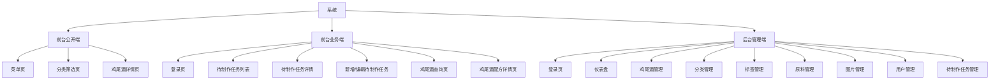
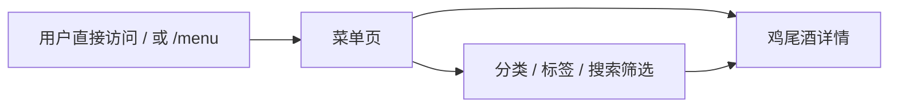
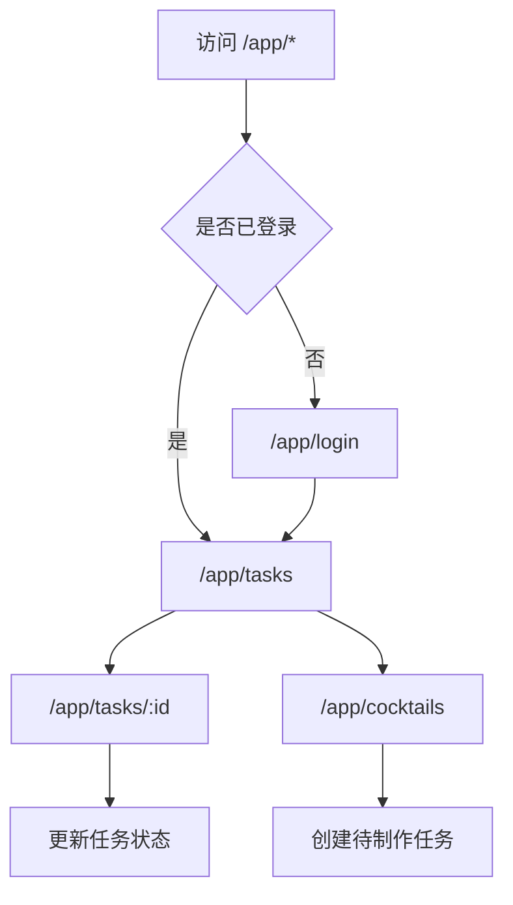
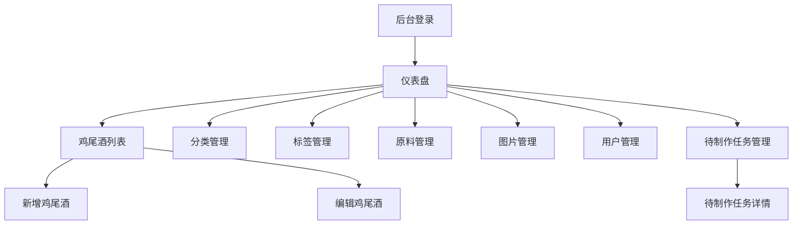

# 鸡尾酒数据库项目前后台页面结构与菜单设计

## 1. 文档说明

本文档用于定义鸡尾酒数据库项目一期的页面结构、菜单层级和页面职责，覆盖以下三部分：

- 前台公开端
- 前台业务端
- 后台管理端

目标是为后续原型设计、前端路由规划、权限划分和开发排期提供基础参考。

## 2. 设计原则

### 2.1 前台公开端

- 以手机端浏览为优先。
- 页面层级尽量浅，便于快速查看菜单。
- 重点突出鸡尾酒图片、名称、风味和详情。

### 2.2 前台业务端

- 以手机端操作为优先。
- 操作链路尽量短，适合服务员快速录入和更新任务。
- 优先展示“待制作”和“配方查看”两类核心动作。

### 2.3 后台管理端

- 以桌面 Web 为主。
- 采用左侧菜单 + 顶部信息栏的常见管理后台布局。
- 重点强化列表、筛选、编辑、状态管理和数据维护效率。

## 3. 总体信息架构

## 4. 前台公开端页面结构

## 4.1 页面目标

前台公开端主要用于对外展示鸡尾酒菜单和详情内容，适合客户或普通访客浏览。

入口约定：

- 用户直接访问 `/` 或 `/menu` 即进入公开菜单。
- 公开端为只读入口，不提供登录后点单、改状态或后台操作。

## 4.2 页面清单

| 页面名称 | 路径建议 | 说明 |
| --- | --- | --- |
| 菜单页 | `/` 或 `/menu` | 公开入口页，展示鸡尾酒列表 |
| 鸡尾酒详情页 | `/cocktails/:id` | 查看鸡尾酒详情、配方、图片 |
| 菜单内筛选与搜索 | 同菜单页内部交互 | 分类、标签、搜索建议在菜单页内完成 |

## 4.3 页面流转

## 4.4 菜单结构建议

一期前台公开端建议采用简化导航，不宜过深。

底部或顶部导航建议：

- 菜单
- 分类
- 搜索

说明：

- 如果页面较少，也可以只保留一个主菜单页，通过顶部筛选和搜索完成导航。

## 4.5 关键页面模块

### 4.5.1 菜单页

建议模块：

- 顶部品牌区 / 标题区
- 搜索框
- 分类筛选栏
- 标签筛选栏
- 鸡尾酒卡片列表

鸡尾酒卡片建议展示：

- 封面图
- 中文名
- 英文名
- 风味标签
- 简短描述

### 4.5.2 鸡尾酒详情页

建议模块：

- 封面图 / 图集轮播
- 名称区
- 简短描述
- 风味与基础信息区
- 配方清单
- 制作方法
- 装饰说明
- 饮用场景

## 5. 前台业务端页面结构

## 5.1 页面目标

前台业务端供管理员和服务员登录后使用，适配手机端，重点支持待制作任务流转和配方查询。

入口约定：

- 业务前台统一从 `/app/login` 进入。
- 未登录用户不可直接访问 `/app/*`。
- 一期“服务员点单”在业务上指创建待制作任务，不单独拆出顾客下单入口。

## 5.2 页面清单

| 页面名称 | 路径建议 | 说明 |
| --- | --- | --- |
| 登录页 | `/app/login` | 服务员 / 管理员登录 |
| 待制作任务列表页 | `/app/tasks` | 查看待制作、制作中、已制作任务 |
| 待制作任务详情页 | `/app/tasks/:id` | 查看任务详情和日志摘要 |
| 鸡尾酒查询页 | `/app/cocktails` | 业务端快速搜索鸡尾酒 |
| 任务新增 / 编辑 / 配方查看 | 作为 `/app/*` 下扩展页面 | 保持受保护业务入口，不单独暴露公开访问路径 |

## 5.3 页面流转

## 5.4 菜单结构建议

前台业务端建议采用手机端底部导航。

底部导航建议：

- 待制作
- 鸡尾酒

说明：

- “待制作”是默认首页。
- “鸡尾酒”用于查配方和快速加入待制作。
- 登录信息和退出操作可放在顶部或二级页，不必额外占用公开入口。

## 5.5 页面层级说明

### 一级页面

- 待制作任务列表
- 鸡尾酒查询页

### 二级页面

- 待制作任务详情页
- 待制作任务新增 / 编辑页
- 鸡尾酒配方详情页 / 快速下单面板

## 5.6 关键页面模块

### 5.6.1 登录页

建议模块：

- Logo / 标题
- 账号输入框
- 密码输入框
- 登录按钮
- 登录错误提示

### 5.6.2 待制作任务列表页

建议模块：

- 顶部标题栏
- 状态切换 Tab
- 搜索框
- 任务列表
- 新增任务浮动按钮

任务卡片建议展示：

- 任务编号
- 鸡尾酒名称
- 数量
- 备注摘要
- 当前状态
- 创建时间
- 指派人

### 5.6.3 待制作任务详情页

建议模块：

- 任务状态区
- 鸡尾酒基础信息
- 数量与备注
- 快捷状态操作按钮
- 配方摘要入口
- 操作日志摘要

### 5.6.4 新增待制作任务页

建议模块：

- 鸡尾酒选择器
- 数量输入
- 备注输入
- 优先级选择
- 指派人选择
- 保存按钮

### 5.6.5 鸡尾酒查询页

建议模块：

- 搜索框
- 鸡尾酒列表
- 分类筛选
- 快捷查看配方
- 快捷加入待制作

### 5.6.6 鸡尾酒配方详情页

建议模块：

- 鸡尾酒名称
- 配方清单
- 制作方法
- 杯型
- 装饰说明
- “加入待制作”按钮

说明：

- “加入待制作”即业务上的“服务员点单”，底层仍落为创建待制作任务。

## 5.7 前台业务端角色菜单建议

### 服务员

- 待制作
- 鸡尾酒
- 我的

### 管理员

- 待制作
- 鸡尾酒
- 我的

说明：

- 一期在前台业务端中，管理员和服务员可见菜单可以保持一致。
- 后续若管理员需要更多业务能力，可增加“统计”或“全部任务”视图。

## 5.8 客户角色预留建议

虽然一期不做客户端功能，但建议在路由和菜单设计上预留用户类型判断。

当前无需定义客户独立入口，避免与现有公开菜单 `/`、`/menu` 混淆。
后续如扩展客户登录、收藏或下单，再单独补充 `/customer/*` 路由设计。

## 6. 后台管理端页面结构

## 6.1 页面目标

后台管理端用于主数据维护、内容发布、账号管理和任务管理，主要面向管理员。

## 6.2 整体布局建议

建议采用后台常见布局：

- 左侧：主导航菜单
- 顶部：面包屑、用户信息、退出登录
- 右侧主区域：列表页 / 表单页 / 详情页

## 6.3 页面清单

| 页面名称 | 路径建议 | 说明 |
| --- | --- | --- |
| 登录页 | `/admin/login` | 后台管理员登录 |
| 仪表盘 | `/admin/dashboard` | 核心数据概览 |
| 鸡尾酒列表页 | `/admin/cocktails` | 管理鸡尾酒 |
| 鸡尾酒新增页 | `/admin/cocktails/create` | 新增鸡尾酒 |
| 鸡尾酒编辑页 | `/admin/cocktails/:id/edit` | 编辑鸡尾酒 |
| 分类管理页 | `/admin/categories` | 管理分类 |
| 标签管理页 | `/admin/tags` | 管理标签 |
| 原料管理页 | `/admin/ingredients` | 管理原料 |
| 图片管理页 | `/admin/images` | 管理图片 |
| 用户管理页 | `/admin/users` | 管理管理员 / 服务员 |
| 待制作任务管理页 | `/admin/production-tasks` | 查看和筛选任务 |
| 待制作任务详情页 | `/admin/production-tasks/:id` | 查看任务详情 |

## 6.4 后台左侧菜单建议

主菜单建议：

- 仪表盘
- 鸡尾酒管理
- 分类管理
- 标签管理
- 原料管理
- 图片管理
- 用户管理
- 待制作任务

## 6.5 后台菜单层级建议

### 一级菜单

- 仪表盘
- 鸡尾酒管理
- 基础资料
- 用户管理
- 待制作任务

### 二级菜单建议

`基础资料` 下可包含：

- 分类管理
- 标签管理
- 原料管理
- 图片管理

如果不想使用分组菜单，也可以直接平铺所有一级菜单。

## 6.6 页面流转

## 6.7 关键页面模块

### 6.7.1 仪表盘

建议模块：

- 鸡尾酒总数
- 分类总数
- 原料总数
- 待制作任务数量
- 最近新增鸡尾酒
- 最近任务动态

### 6.7.2 鸡尾酒列表页

建议模块：

- 搜索栏
- 分类筛选
- 状态筛选
- 新增按钮
- 表格列表
- 分页

表格字段建议：

- ID
- 中文名
- 英文名
- 分类
- 发布状态
- 是否显示
- 排序值
- 更新时间
- 操作

### 6.7.3 鸡尾酒新增 / 编辑页

建议模块：

- 基础信息表单
- 分类选择
- 标签选择
- 配方编辑区
- 图片上传区
- 发布状态设置
- 保存按钮

可考虑分 Tab：

- 基础信息
- 配方
- 图片
- 发布设置

### 6.7.4 分类 / 标签 / 原料管理页

建议模块：

- 搜索栏
- 新增按钮
- 表格列表
- 启用状态切换
- 编辑 / 删除操作

### 6.7.5 用户管理页

建议模块：

- 角色筛选
- 状态筛选
- 用户列表
- 新增用户按钮
- 编辑 / 禁用操作

用户列表字段建议：

- 用户名
- 显示名
- 角色
- 状态
- 最后登录时间
- 操作

### 6.7.6 待制作任务管理页

建议模块：

- 状态筛选
- 时间筛选
- 创建人筛选
- 任务表格
- 任务详情入口

表格字段建议：

- 任务编号
- 鸡尾酒名称
- 数量
- 状态
- 优先级
- 创建人
- 指派人
- 创建时间
- 完成时间
- 操作

## 7. 路由与权限建议

## 7.1 路由分区建议

- 公开前台路由：`/`、`/menu`、`/cocktails/:id`
- 业务前台路由：从 `/app/login` 进入，登录后访问 `/app/*`
- 后台管理路由：`/admin/*`

## 7.2 权限控制建议

| 路由区 | 未登录 | `staff` | `admin` | `customer` |
| --- | --- | --- | --- | --- |
| 前台公开端 | 可访问 | 可访问 | 可访问 | 预留，当前与访客一致 |
| 前台业务端 | 不可访问 | 可访问 | 可访问 | 不可访问 |
| 后台管理端 | 不可访问 | 不可访问 | 可访问 | 不可访问 |

## 7.3 菜单渲染建议

- 登录后根据 `role_code` 动态渲染菜单。
- 一期前台业务端可统一渲染 `staff` 和 `admin` 菜单。
- 后续新增 `customer` 时，再独立扩展客户菜单，不影响现有公开菜单入口。

## 8. 一期原型优先级建议

如果先做原型，建议按以下顺序出图：

1. 前台业务端待制作任务列表页
2. 前台业务端鸡尾酒配方详情页
3. 前台公开端菜单页
4. 后台鸡尾酒列表页
5. 后台鸡尾酒编辑页
6. 后台用户管理页

原因：

- 这几页最能决定产品主流程是否顺手。
- 也最早影响接口设计和数据库字段取舍。

## 9. 总结

一期建议把系统明确拆成三套页面体系：

- 前台公开端：负责菜单展示，用户直接访问 `/` 或 `/menu`
- 前台业务端：负责登录、查配方、创建待制作任务、维护任务状态
- 后台管理端：负责主数据和账号管理

这样拆分后，页面职责更清晰，后续做前端工程、路由权限、接口联调都会更稳定。

如果你下一步想继续推进，我可以直接继续帮你补其中一个：

- 低保真页面原型说明文档
- 前后端技术选型建议
- 直接初始化项目骨架
